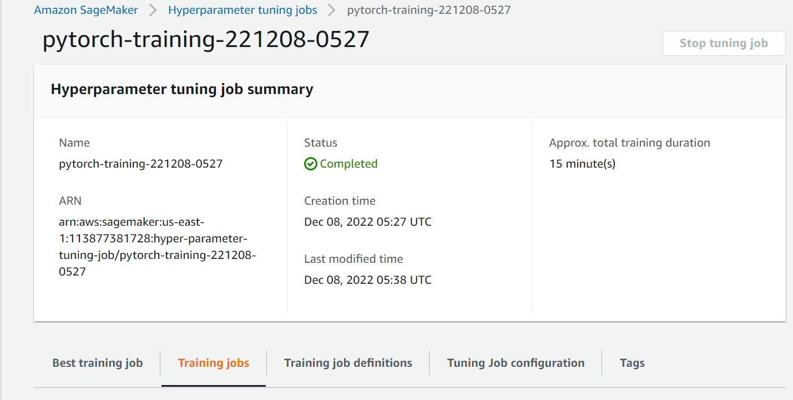
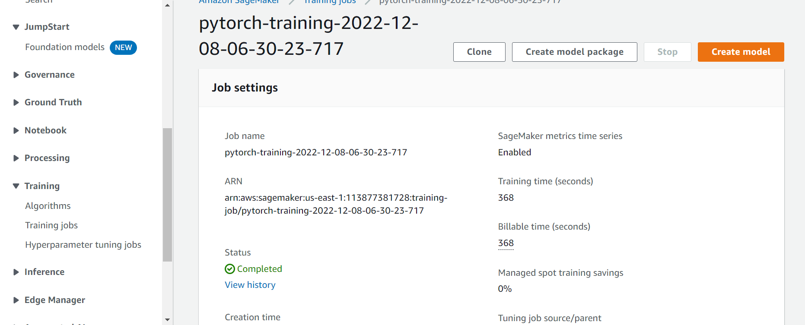

# Image Classification using AWS SageMaker

Useing AWS Sagemaker and PyTorch to train a RESNET50 pretrained model that can perform image classification by using the Sagemaker profiling, debugger, hyperparameter tuning and other good ML engineering practices. 

## Project Set Up and Installation
**steps**:
- downloading data from data source 
- uploading data files S3 Bucket to be used with sagemaker Estimators
- creating PyTorch Custom ResNET50 model that train and predict resnet18 in pytorch to be used as entry point for sagemaker estimator
- creating hyperparameter tuner estimator to initiate 4 training jobs on Sagemaker and find best model parameters
- creating a Sagemaker Training Estimator with the best parameters and adding Debugger and profiler Hooks
- Debugger and Profiler Catches System and training metrics Such as Overfitting.
- Creating a pytorch Estimator with the trained model with inference script as entry point
- the inference script defines what type of data to be accepted through the API and passes to model
- Deploys the Pytorch Estimator to an Endpoint
- cleanup

**files**:
- hpo.py: this file contains pytorch training script used for sagemaker hyperparameter tuner estimator to find best hyperparameters
- train_model.py: this file contains pytorch training and testing scripts and model architechture to be used with a sagemaker estimator to fine tune a model with best hyperparameters found and makes use of sagemaker debugger and profiler to track how well model is doing
- inference.py: entry point for PyTorch Trained Model Estimator to load Deploy model to endpoint and accept data and send requests to The API to perform inferences.
- train_and_deploy.ipynb: in this notebook the data is downloaded from source and stored in S3 Bucket to be used with sagemaker, builds the sagemaker estimators, Deploys the model to an EndPoint and display debugger and profiler reports.

## Dataset
The dataset is the dogbreed classification dataset which contains 133 different classes of dogs breads
The project is designed to be dataset independent so if there is a dataset that is more interesting or relevant to your work, you are welcome to use it to complete the project.

### Access
Upload the data to an S3 bucket through the AWS Gateway so that SageMaker has access to the data. 

## Hyperparameter Tuning
A ResNET18 pretrained model was used for finetuning on this task and the following hyperparameters values were tuned:
- batch-size: [32,64,128,256,512]
- learning-rate: range(0.001,0.1)
- epochs: [2,4,6]

hyperparameter tuning job:

Training job:

## Debugging and Profiling
**Debugger Configs**: the following sagemaker smdebug rules are hooked to the training pytorch scripts and the sagemaker estimator in the notebook to track the following metrics during training
- vanishing gradient
- overfitting
- poor weight initialization
- overtraining

**Profiler Configs**: the following rules applied to training pytorch scripts and sagemaker estimator to track system metrics during training such as:
- LowGPUUtilization
- Profiler report is provided in the next Results section which includes various system metrics

### Results
**Debugger**: Revealed PoorWeightInitialization issue.

**Profiler** Revealed Low GPU Utilization

profiler Full HTML report included [Report](./profiler-report.html)

## Model Deployment
- The Sagemaker estimator model is deployed to a sagemaker maker endpoint on machine of instance-type: ml.m4.xlarge 
- the endpoint can be queried by send requests to the endpoint through a Pytorch estimator using inference.py
- the json object to be sent in the GET Request to the API can have contentType:"images/jpeg" and image as bytesArray

Deployed Model Endpoint in Service:

Prediction from Queried endpoint:

